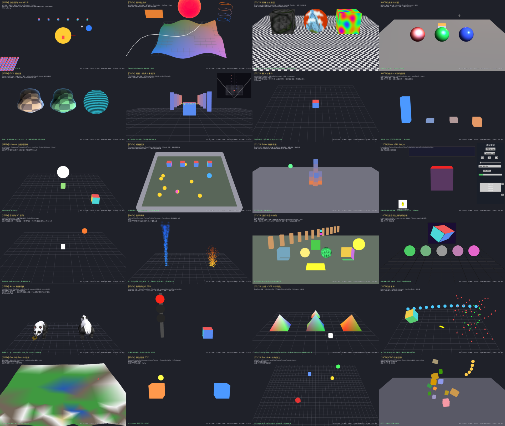

# panda3d_demo01 —— 用 24 个可运行课程学透 Panda3D

> 一个以**学习**为目的的 Panda3D 1.10 工程：24 个课程覆盖 `panda3d.core / direct / bullet / ode / physics / ai / egg`
> 共 **426** 个 API 条目；每课是一个独立文件，注释写的是“为什么”，配套 **174 个用例** 验证每个 API 的真实行为。



---

## 1. 快速开始

```bash
cd panda3d_demo01
scripts/setup.sh                 # 创建 .venv 并安装 panda3d + pytest（国内可设 PIP_INDEX_URL 镜像）
scripts/run.sh                   # 开窗，从第 1 课开始；N/P 翻页
scripts/run.sh --lesson bullet_physics
scripts/test.sh                  # 全量测试 + 覆盖率 + 文档一致性检查
```

也可以用 `make`：`make setup / run LESSON=collision / test / smoke / wheel / app / clean`（`make help` 查看全部）。

| 全局按键 | 作用 |
|---|---|
| `N` / `P`（PageDown/PageUp） | 下一课 / 上一课 |
| `F5` | 重新加载当前课 |
| 方向键 / 滚轮 | 轨道相机旋转 / 缩放 |
| `H` | 隐藏/显示 HUD |
| `F12` | 截图 |
| `ESC` | 退出 |

每课的专属按键显示在左上角 HUD，也列在 [docs/API_COVERAGE.md](docs/API_COVERAGE.md)。

---

## 2. 课程地图

| # | key | 主题 | 核心 API |
|---|---|---|---|
| 01 | `scene_graph` | 场景图 / NodePath | reparent、wrtReparent、instance_to、find `**/=tag`、flatten_strong |
| 02 | `procedural_geom` | 程序化几何 | GeomVertexFormat/Writer/Rewriter、GeomTriangles/Lines/Points、CardMaker、Rope |
| 03 | `textures` | 纹理 | PNMImage、TextureStage 多层混合、TexGen、动态 RAM 纹理 |
| 04 | `lighting` | 光照材质 | 4 种灯、Material、ShaderGenerator、阴影 |
| 05 | `shaders` | GLSL | Shader.load/make、p3d_* 内置输入、shader 继承覆盖 |
| 06 | `camera_lens` | 相机镜头 | FOV、正交、多 DisplayRegion、project/extrude、dolly zoom |
| 07 | `input_events` | 输入事件 | accept/-up/-repeat、轮询、messenger、ButtonThrower |
| 08 | `tasks_clock` | 任务时钟 | cont/done/again、协程、线程任务链、异步加载、PStats |
| 09 | `intervals` | 动画时间轴 | Lerp*、Sequence/Parallel、LerpFunc、Projectile、seek |
| 10 | `collision` | 碰撞 | Queue/Pusher/Event/Floor、BitMask、射线拾取 |
| 11 | `bullet_physics` | Bullet | 刚体、冲量、铰链、射线/接触查询 |
| 12 | `gui_text` | DirectGUI | 10 种控件、TextNode、锚点 |
| 13 | `audio` | 音频 | sfx/music、Audio3DManager、SoundInterval |
| 14 | `particles` | 粒子 | Factory/Emitter/Renderer、ForceGroup、.ptf |
| 15 | `render_states` | 渲染状态 | Fog、透明 bin、混合、裁剪面、Billboard/Compass、LOD |
| 16 | `postprocess` | RTT/后处理 | make_texture_buffer、FilterManager + 自写 GLSL 滤镜 |
| 17 | `actor_animation` | 骨骼动画 | Actor、exposeJoint、controlJoint、blend、actorInterval |
| 18 | `fsm` | 状态机 | defaultTransitions、filterXxx、demand/forceTransition |
| 19 | `files_serialization` | 文件/VFS | EggData、BAM、RAM 盘、Multifile、Datagram |
| 20 | `math` | 数学库 | LVector/LMatrix/LQuaternion、TransformState、包围体 |
| 21 | `terrain` | 地形 | GeoMipTerrain、StackedPerlinNoise2 |
| 22 | `networking` | 原生网络 | QueuedConnection*、PyDatagram、同进程 echo |
| 23 | `ai_steering` | PandaAI | pursue/evade/seek/wander |
| 24 | `ode_physics` | ODE | OdeWorld/Body/Space/Geom、接触关节组 |

推荐学习顺序与每课练习见 [docs/LEARNING_PATH.md](docs/LEARNING_PATH.md)。

---

## 3. 工程结构

```
panda3d_demo01/
├── pyproject.toml          # PEP 621 元数据 + pytest/coverage 配置
├── setup.py                # 仅用于 Panda3D build_apps 打包
├── run_demo.py             # 独立启动脚本（build_apps 入口）
├── Makefile                # 快捷命令
├── scripts/                # setup / run / test / build 脚本（真正的逻辑）
├── tools/gen_api_coverage.py   # 从 Lesson.apis 生成 docs/API_COVERAGE.md
├── docs/                   # 架构、学习路径、踩坑、API 清单
├── src/panda3d_demo01/
│   ├── __main__.py         # CLI：--lesson/--list/--offscreen/--headless/--autopilot
│   ├── app.py              # DemoApp(ShowBase)：课程切换、HUD、autopilot 截图
│   ├── config.py           # PRC 配置系统
│   ├── hud.py              # OnscreenText HUD
│   ├── assets/             # GLSL 着色器、.prc 配置
│   ├── core/               # Lesson 基类、注册表、程序化资源、相机、能力探测、字体
│   └── lessons/            # l01 ~ l24
└── tests/                  # 174 个用例（UT + 子进程 e2e）
```

架构图（Mermaid）见 [docs/ARCHITECTURE.md](docs/ARCHITECTURE.md)。

---

## 4. 三种运行模式

| 模式 | 命令 | 窗口 | 适用 |
|---|---|---|---|
| WINDOW | `scripts/run.sh` | 真实窗口 + 键鼠 | 交互学习 |
| OFFSCREEN | `--offscreen` | GraphicsBuffer，可渲染/截图 | 本机冒烟、截图回归 |
| HEADLESS | `--headless` | `window-type none`，无 GSG | 无 GPU 的 CI，只验证逻辑 |

```bash
# 离屏跑完 24 课并截图 + JSON 报告（CI 冒烟）
python -m panda3d_demo01 --offscreen --autopilot --frames 30 --shots out/shots --report out/report.json
```

autopilot 使用**非实时时钟**（每帧固定 1/30 秒），结果与机器快慢无关。

---

## 5. 测试

```bash
scripts/test.sh            # 全部：文档检查 + pytest(含 e2e) + 覆盖率（HTML: out/htmlcov）
scripts/test.sh unit       # 只跑进程内 UT
scripts/test.sh headless   # 模拟无 GPU 环境（13 个 window 用例自动 skip）
scripts/test.sh smoke      # 离屏 autopilot
scripts/test.sh -k bullet  # 透传 pytest 参数
```

| 测试文件 | 覆盖 |
|---|---|
| `test_framework.py` | PRC、注册表、程序化资源、**24 课生命周期零泄漏**（节点/任务/事件）、字体、轨道相机 |
| `test_scene_geometry.py` | L01 L02 L03 L20 |
| `test_rendering.py` | L04 L05 L06 L15 L16（含灰度滤镜像素级验证） |
| `test_logic_systems.py` | L07 L08 L09 L18 |
| `test_physics_ai.py` | L10 L11 L23 L24 |
| `test_media_content.py` | L12 L13 L14 L17 L19 L21 L22 |
| `test_app_e2e.py` | CLI、子进程 autopilot（headless + offscreen 截图非空白）、文档新鲜度 |

当前结果：**174 passed，行覆盖率 90%**（`app.py` 在子进程中运行，未计入）。

---

## 6. 构建

```bash
scripts/build.sh check   # compileall + 资源 + 文档一致性
scripts/build.sh wheel   # dist/panda3d_demo01-0.1.0-py3-none-any.whl
scripts/build.sh bam     # 程序化生成 .egg → egg2bam → .bam
scripts/build.sh app     # Panda3D build_apps 冻结为独立应用（需联网）
```

### 验证状态

| 功能 | 状态 | 说明 |
|---|---|---|
| 离屏运行 24 节课 + 截图 | ✅ 已实测 | macOS / M3 Pro |
| headless 模式测试 | ✅ 已实测 | 157 passed / 13 skipped |
| `build.sh check / wheel / bam` | ✅ 已实测 | 生成的 wheel 内含 GLSL 和 .prc 资源 |
| 开窗交互（键鼠、HUD 中文） | ⚠️ 未自动化测试 | 离屏模式没有键鼠；输入逻辑通过 `messenger.send` 在 UT 中验证 |
| `build.sh app`（build_apps） | ❌ 未实测 | 配置已写好，需要联网下载各平台 wheel |
| Linux / Windows | ❌ 未实测 | 代码没有依赖平台特性，字体路径已预置候选 |
| CI 流水线 | ❌ 未配置 | 可直接用 `scripts/test.sh headless` 作为 CI 命令 |

---

## 7. 环境说明

* 已验证：macOS 15 / Apple M3 Pro / Python 3.13 / panda3d 1.10.16。
* Apple Silicon 上 OpenGL 是 legacy 2.1 context → GLSL 1.20；**没有 Cg**，所以 `CommonFilters` 不可用，L16 用自写 GLSL 滤镜替代。
* HUD 中文需要 CJK 字体：自动探测 PingFang 等系统字体，可用 `PANDA3D_DEMO01_FONT=/path/font.ttf` 指定；找不到则 HUD 退化为英文。
* 程序化资源（wav、bam、ptf、mf）写到 `$PANDA3D_DEMO01_CACHE`（默认系统临时目录下 `panda3d_demo01/`）。

开发中踩过的 20 个坑整理在 [docs/PITFALLS.md](docs/PITFALLS.md)，强烈建议阅读。

---

## 8. 文档索引

| 文档 | 内容 |
|---|---|
| [docs/LEARNING_PATH.md](docs/LEARNING_PATH.md) | 6 个阶段的学习顺序，每节课的要点和练习 |
| [docs/ARCHITECTURE.md](docs/ARCHITECTURE.md) | 模块关系、一帧的执行顺序、课程生命周期、渲染输出、测试架构（Mermaid） |
| [docs/PITFALLS.md](docs/PITFALLS.md) | 20 条真实踩坑：现象 → 根因 → 解法 → 位置 |
| [docs/API_COVERAGE.md](docs/API_COVERAGE.md) | 自动生成的 426 个 API 清单（按模块、按课程） |
| [docs/ADDING_A_LESSON.md](docs/ADDING_A_LESSON.md) | 新增一节课的步骤和约定 |
| [CHANGELOG.md](CHANGELOG.md) | 版本变更记录 |

许可证：[MIT](LICENSE)。
