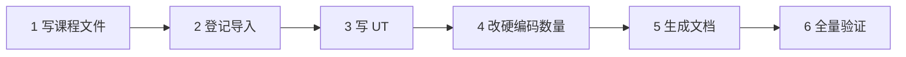

# 如何新增一节课（以 L25 为例）

整个流程约 6 步，全部完成后 `scripts/test.sh` 必须是绿的。



## 1. 写课程文件 `src/panda3d_demo01/lessons/l25_xxx.py`

```python
"""L25 主题 —— 一句话说明。

模块文档写“原理 + 为什么”，这是学习材料的主体。
"""

from __future__ import annotations

from ..core import Lesson, capabilities, register
from ..core.procedural import make_cube


@register
class XxxLesson(Lesson):
    key = "xxx"                    # 唯一；用于 --lesson xxx 和任务名前缀
    order = 25                     # 决定 N/P 翻页顺序，必须连续
    title = "中文标题"
    title_en = "English Title"     # 没有 CJK 字体时 HUD 用它
    summary = "一句话：覆盖了哪些点"
    apis = ("SomeClass.method", ...)   # 必填，docs/API_COVERAGE.md 从这里生成
    controls = ("K 做某事",)

    def setup(self) -> None:
        self.place_camera((0, -15, 6))
        cube = make_cube(1)
        cube.reparent_to(self.root)            # 3D 内容只挂 self.root
        self.accept("k", self.do_something)    # 事件：stop 时自动 ignoreAll
        self.add_task(self._update, "update")  # 任务：stop 时自动移除
        self.status("HUD 状态栏文本")

    def teardown(self) -> None:
        """只释放“非节点”资源：缓冲区、物理世界、网络连接、Actor.cleanup……"""

    def do_something(self) -> int:
        self.state["result"] = 42              # 可观测结果写 state，UT 断言它
        return 42

    def _update(self, task):
        return task.cont
```

**硬性约定**

| 约定 | 原因 |
|---|---|
| 3D 挂 `self.root`，2D 挂 `self.gui_root` | stop 时整棵子树 removeNode，零残留 |
| 任务/Interval/其它资源用 `add_task` / `track` / `on_cleanup` 登记 | 由基类统一回收，生命周期 UT 会检查 |
| 协程任务循环写 `while self.active` | await 中的协程无法被 remove（PITFALLS #3） |
| 依赖 GPU 的功能先 `capabilities.get(self.base)` 判断 | 同一份代码要在 offscreen / headless / 无 Cg 环境下都能跑 |
| `self.base.camera` / `cam` / `mouseWatcherNode` 可能是 None | headless 没有相机，offscreen 没有键鼠 |
| C++ 类用 snake_case，`direct.*` 的 Python 类用 camelCase | Interval/Actor/FSM 没有 snake_case 别名（PITFALLS #5） |
| 公开方法要返回可断言的值 | 让 UT 不依赖渲染结果 |

## 2. 登记导入

在 `lessons/__init__.py` 的 docstring 表格和 `from . import (...)` 里都加上 `l25_xxx`。

## 3. 写 UT

按主题放进对应的测试文件（见 README 第 5 节表格），用 `lesson` 与 `step` 夹具：

```python
class TestXxx:
    def test_do_something(self, lesson, step):
        x = lesson("xxx")          # 已 start，测试结束自动 stop
        step(10)                   # 推进 10 帧（非实时时钟，1 帧 = 1/30 秒）
        assert x.do_something() == 42

    @pytest.mark.window            # 需要渲染的用例；headless 模式自动 skip
    def test_render_related(self, lesson): ...
```

`test_lesson_lifecycle_no_leaks` 会自动覆盖新课（参数化读取注册表），不用另写。

## 4. 修改写死的课程数量（容易漏）

| 文件 | 位置 |
|---|---|
| `tests/test_framework.py` | `test_24_lessons_ordered_unique`：`== 24`、`range(1, 25)` |
| `tests/test_app_e2e.py` | `test_list_lessons_text`、`test_cli_headless_autopilot_all_lessons` 里的 `24` |
| `README.md` | 标题行的课程数 / API 数 / 用例数、第 2 节课程地图 |
| `docs/LEARNING_PATH.md` | 把新课放进合适的阶段 |

## 5. 重新生成 API 清单

```bash
.venv/bin/python tools/gen_api_coverage.py     # 或 make docs
```

## 6. 全量验证

```bash
scripts/test.sh                  # 文档一致性 + UT + e2e + 覆盖率
scripts/test.sh headless         # 确认无 GPU 环境不崩
scripts/test.sh smoke            # 看 out/shots/25_xxx.png 画面是否正常
cp out/contact_sheet.png docs/images/contact_sheet.png   # 更新 README 截图总览
```

新踩到的坑请追加到 `docs/PITFALLS.md`（现象 → 根因 → 解法 → 位置），并在 `CHANGELOG.md` 记一笔。
