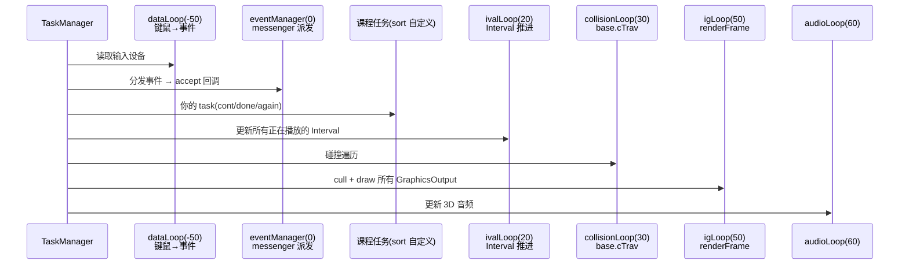
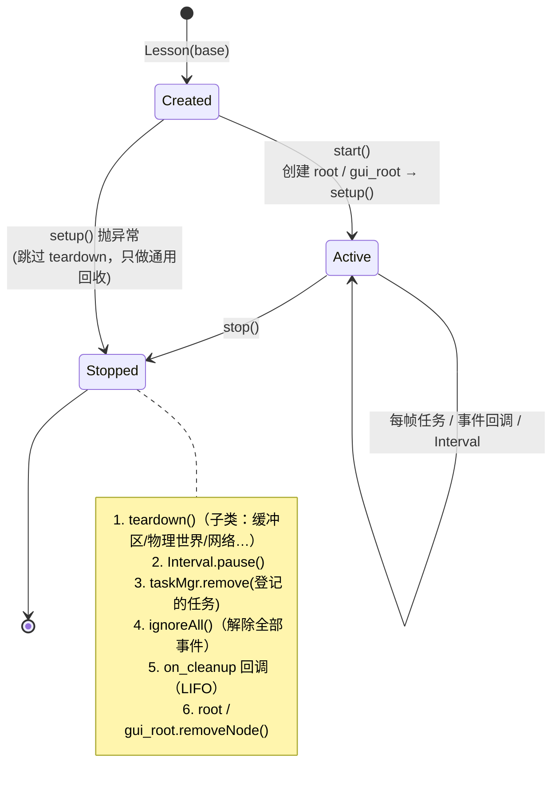
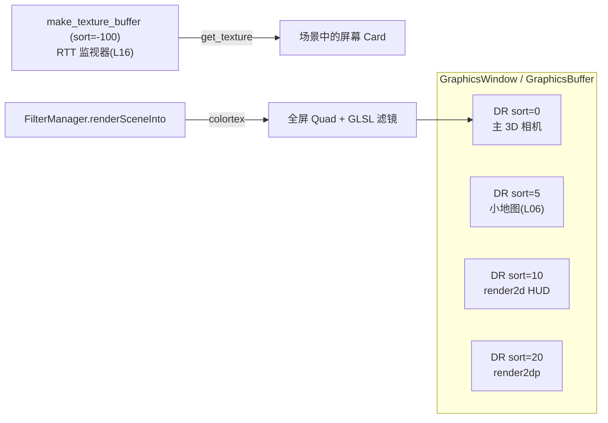
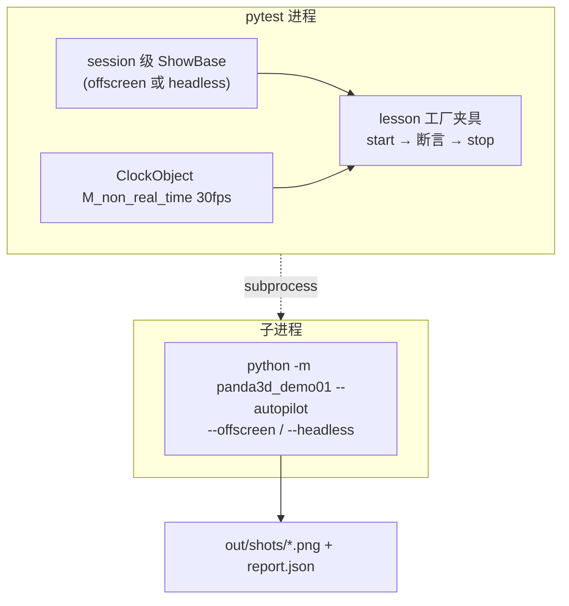

# 架构说明

## 1. 模块关系

```mermaid
flowchart LR
    CLI["__main__.py<br/>argparse CLI"] --> CFG["config.py<br/>RuntimeConfig → PRC"]
    CLI --> APP["app.py<br/>DemoApp(ShowBase)"]
    APP --> HUD["hud.py<br/>OnscreenText"]
    APP --> ORBIT["core/camera_rig.py<br/>OrbitCamera"]
    APP --> REG["core/registry.py<br/>all_lessons()"]
    REG --> LES["lessons/l01..l24<br/>@register"]
    LES --> BASE["core/lesson.py<br/>Lesson(DirectObject)"]
    LES --> PROC["core/procedural.py<br/>几何/贴图/音频工厂"]
    LES --> CAPS["core/capabilities.py<br/>GSG 能力探测"]
    TOOLS["tools/gen_api_coverage.py"] -. 读取 Lesson.apis .-> LES
    TOOLS --> DOC["docs/API_COVERAGE.md"]
    TESTS["tests/*"] --> LES
    TESTS -. 子进程 .-> CLI
```

## 2. ShowBase 一帧的执行顺序

`taskMgr.step()` 就是一帧；`base.run()` 只是不停地调用它。



> 课程里自建的 Traverser/物理世界都在自己的任务中推进（sort 25~30），与默认顺序对齐。

## 3. Lesson 生命周期（RAII）



测试 `test_lesson_lifecycle_no_leaks` 对 24 课逐一断言：stop 后**节点、任务、事件订阅**全部清零，且能重复 start。

## 4. 场景图布局

```mermaid
flowchart TB
    R[render] --> CAM[camera → cam(Lens)]
    R --> PIV[orbit-pivot] --> CAM2[camera 被 OrbitCamera 接管]
    R --> LR["lesson:&lt;key&gt;  ← Lesson.root"]
    LR --> A[课程自己的 3D 内容]
    R2[render2d] --> A2[aspect2d]
    A2 --> GR["gui:&lt;key&gt;  ← Lesson.gui_root"]
    A2 --> ANC[a2dTopLeft / a2dTopRight ...] --> HUDN[HUD OnscreenText]
```

## 5. 渲染输出（L06 / L16）



## 6. 测试架构



**为什么 App 测试要用子进程？** Panda3D 一个进程只允许一个 ShowBase；UT 共享的那个 `base` 与 `DemoApp` 无法共存。
子进程恰好也是用户真实的使用方式，所以 e2e 同时验证了 CLI、PRC、autopilot 与截图。
