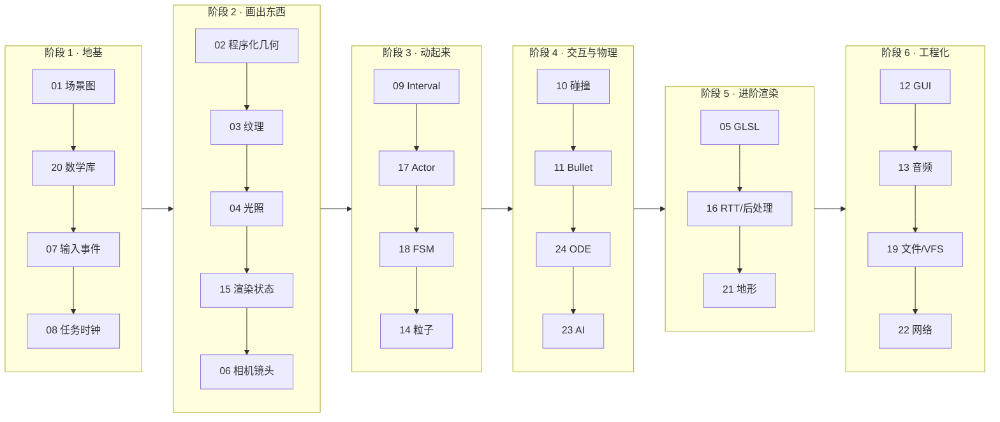

# 学习路径（先全貌、后细节）

每一课的学习方法：
1. `scripts/run.sh --lesson <key>` 看效果、按 HUD 上的按键；
2. 打开 `src/panda3d_demo01/lessons/lXX_*.py` 读模块文档与注释；
3. 读对应测试（README 第 5 节的表格），测试就是“这个 API 真实行为”的规格说明；
4. 做下面的练习，然后跑 `scripts/test.sh -k <关键词>` 确认没有破坏已有行为。

---

## 阶段 1 · 地基

### L01 场景图（`scene_graph`）
- **一句话**：NodePath 是“路径句柄”，变换沿父子链相乘。
- **必记**：`reparent_to` 保局部变换、`wrt_reparent_to` 保世界变换；`hide` 仍参与遍历、`stash` 连遍历都跳过；`instance_to` 共享节点、`copy_to` 深拷贝。
- **练习**：给月亮再加一颗“卫星的卫星”；用 `find_all_matches("**/+GeomNode")` 统计 flatten 前后的节点数变化。

### L20 数学库（`math`）
- **一句话**：Z 上 Y 前的右手系；点受平移、向量不受。
- **必记**：`xform_point` vs `xform_vec`；`TransformState.compose` 的顺序 = 先子后父；四元数插值要走最短弧。
- **练习**：实现 `look_at` 的手写版本（用 cross 构造正交基），和 `panda3d.core.look_at` 结果对比。

### L07 输入事件（`input_events`）
- **一句话**：输入 → ButtonThrower → 事件名 → messenger → accept 回调。
- **必记**：`key / key-up / key-repeat / shift-key`；`messenger.send(name, [args])` 的参数拼在 extraArgs 后面。
- **练习**：做一个“双击 W 冲刺”（记录两次 `w` 事件的时间差）。

### L08 任务时钟（`tasks_clock`）
- **一句话**：一帧 = TaskManager 按 sort 执行所有任务。
- **必记**：`task.cont / done / again`；协程任务 `await Task.pause()`；线程任务链不要碰场景图。
- **练习**：把质数计算改为分帧执行（每帧只算一段），比较与线程链的差异。

## 阶段 2 · 画出东西

### L02 程序化几何
- **必记**：Format → VertexData → Writer → Primitive → Geom → GeomNode；动态网格用 `UH_dynamic` + `GeomVertexRewriter`。
- **练习**：把波浪网格改成 `GeomTristrips`，比较索引数量。

### L03 纹理
- **必记**：PNMImage(CPU) → Texture(GPU)；TextureStage 的 mode/sort；TexGen 不需要 UV。
- **练习**：把动态等离子纹理改为 `Texture.modify_ram_image()` 就地修改，避免每次分配 bytes。

### L04 光照
- **必记**：灯的“位置”（在哪个节点）与“作用范围”（set_light 在哪棵子树）分离。
- **练习**：给聚光灯开阴影（`set_shadow_caster`），观察 lens 的 near/far 对阴影精度的影响。

### L15 渲染状态
- **必记**：所有 `set_xxx` = `set_attrib(XxxAttrib)`；透明物体放 `transparent` bin 并关深度写。
- **练习**：用 `ColorBlendAttrib` 实现“乘法混合”阴影贴花。

### L06 相机镜头
- **必记**：窗口 → DisplayRegion → Camera → Lens；`project` 3D→2D、`extrude` 2D→3D。
- **练习**：做一个左右分屏（两个 DR 各半），右侧相机跟随 L07 的玩家方块。

## 阶段 3 · 动起来

### L09 Interval
- **必记**：Interval 是 Python 类 → camelCase；`setT` 可随意 seek。
- **练习**：用 `Sequence + Func` 做一个“红绿灯”，再和 L18 的 FSM 版本对比优劣。

### L17 Actor
- **必记**：`controlJoint` 必须在动画绑定前调用；骨骼矩阵用组合而不是 `set_h`。
- **练习**：让 panda2 的头部始终看向相机（计算相机在骨骼父空间下的方向）。

### L18 FSM
- **必记**：`defaultTransitions` 与 `filterXxx` 二选一或组合；`request` 可被拒绝、`demand` 不可。
- **练习**：给 Character 增加 `Crouch` 状态，只允许从 `Idle` 进入。

### L14 粒子
- **必记**：Factory / Emitter / Renderer 三件套 + ForceGroup；必须 `enable_particles()`。
- **练习**：做一个“烟花”：`ETRADIATE` 发射 + `setSystemLifespan` 让系统自动结束。

## 阶段 4 · 交互与物理

### L10 碰撞
- **必记**：from/into 与 BitMask；四种 Handler 的适用场景。
- **练习**：用 `CollisionHandlerEvent.add_out_pattern` 做“离开区域”触发器。

### L11 Bullet / L24 ODE
- **必记**：Bullet 刚体节点即场景图节点（自动同步）；ODE 需要自己同步、自己管接触关节组。
- **练习**：同一堆方块在两个引擎中各跑 3 秒，比较静止时间与穿透情况。

### L23 PandaAI
- **必记**：AIWorld.update 每帧驱动；行为可叠加并按优先级混合。
- **练习**：给猎人加 `obstacle_avoidance`，在场景里放几根柱子。

## 阶段 5 · 进阶渲染

### L05 GLSL
- **必记**：`p3d_*` 内置输入；子节点可覆盖父节点的 shader input。
- **练习**：在 wobble 着色器中读取 `p3d_LightSource[0]`，替换掉手动传入的 `light_dir`。

### L16 RTT / 后处理
- **必记**：`make_texture_buffer + make_camera`；`FilterManager.renderSceneInto` 返回全屏 quad。
- **练习**：做两级滤镜链（先 Sobel，再用 `renderQuadInto` 做高斯模糊）。

### L21 地形
- **必记**：高度图 2^n+1；`get_elevation × sz` 贴地；focal point 决定 LOD。
- **练习**：把 color map 换成按坡度着色（相邻像素高度差）。

## 阶段 6 · 工程化

### L12 GUI · L13 音频 · L19 文件/VFS · L22 网络
- **必记**：aspect2d 与 a2d* 锚点；null 音频后端用于 CI；VFS 挂载让资源打包零改代码；Panda TCP 自带分帧。
- **练习**：把 L19 的 Datagram 存档通过 L22 的网络发给“服务器”，服务器回写后客户端重新加载。
